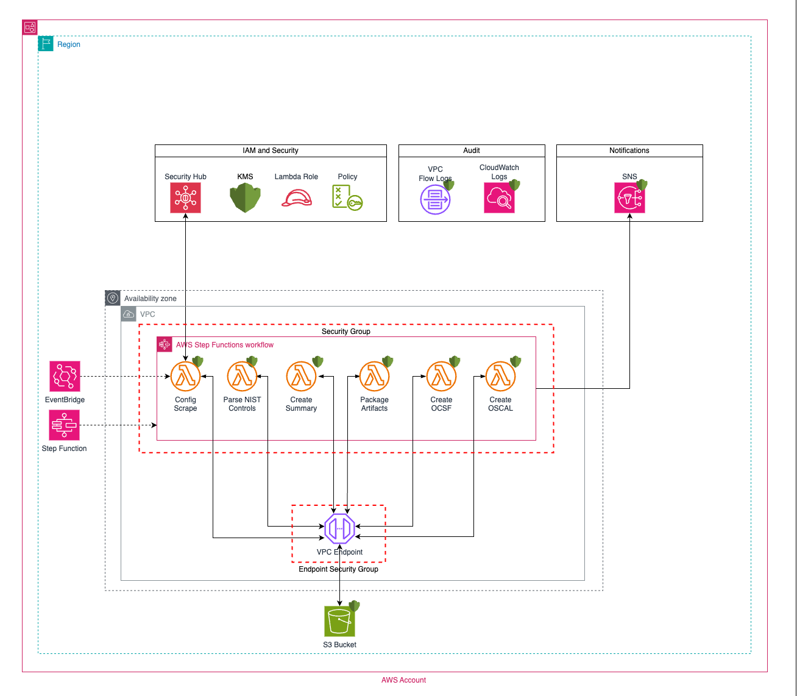

# Security Hub Compliance Analyzer CDK (Python) Project

## Description
Security Hub Compliance Analyzer (SHCA) generates artifacts in support of Department of Defense Risk Management Framework (RMF) Information System accreditation.  Utilizing Amazon Web Services provided documentation, mapping NIST800-53-Rev-5 Controls to [AWS Security Hub Security Control IDs](https://docs.aws.amazon.com/securityhub/latest/userguide/securityhub-controls-reference.html), SHCA requests the current environment compliance from Security Hub and generates a zip file stored in Amazon S3 containing discrete artifacts in CSV, JSON, OCSF providing SecOps with artifacts to import into the RMF tool.

## Security Hub Compliance Analyzer Diagram


## AWS Step Functions, State Machine Graph

### 1-config-rules-scrape (AWS Security Hub Findings Extraction)
All findings within Security Hub are extracted and saved in JSON.

### 2-parse-nist-controls (AWS Security Hub Findings Condense and Convert)
The most recent finding from each control/resource id in the JSON is written to a CSV file for better analysis and readability

### 3-create-summary (AWS Security Hub Summary)
A summary of all controls is created from the CSV file following the following methodology
- compliant = all findings for the control have a value of PASSED or have a combination of PASSED and NOT_AVAILABLE
- non-compliant = all findings for the control have a value of FAILED or a have a combination of FAILED and NOT_AVAILABLE
- partially compliant = findings for the control have at least one FAILED finding and at least one PASSED finding and possibly findings of NOT_AVAILABLE

### 4-package-artifacts (Artifact Generation and zip)
This step creates a file for each NIST SP 800-53 control based on that control's status and stores them in two folders:

- controls_ready_to_import_into_rmf_tool
    - Contains controls which have only PASSED findings
- controls_which_require_attention
    - Contains controls which have FAILED findings

Additionally, this step retrieves and includes various files from an S3 bucket. The folders and their contents are:

- aws/ato_next_securityhub_rules_nist_800_53_rev_5
    - Contains aws_securityhub_controls.csv, the file provides reference for Security Hub SecurityControlID's, associated AWS Config rule names, and related NIST SP 800-53r5 controls.
- original_findings_from_securityhub_in_json
    - Contains the original json files (securityhub_original_findings_asff.json and securityhub_original_findings_ocsf.json) after querying the Security Hub database.
- condensed_findings_from_securityhub_in_csv
    - Contains a condensed version of the original findings in a CSV format (securityhub_nist80053_findings_condensed.csv), with only the latest observed finding for each control/resource.
- control_summary_of_findings_from_securityhub_in_csv
    - Contains a summary of the compliance status of all controls, by control, in the securityhub_nist80053_findings_summary.csv file.

These files provide comprehensive data about the security state of AWS resources, based on Security Hub's NIST SP 800-53 automated security checks.

## CDK Overview and Setup

### Prerequisites

Here's what you need to install to use the AWS CDK.

Validating Python 3.7 or later, pip, virtualenv, and Node.js Installation on Linux

#### Node.js

```bash
node --version
```

All AWS CDK developers, even those working in Python, Java, or C#, need Node.js 14.15.0 or later. All supported languages use the same backend, which runs on [Node.js](https://nodejs.org/en/download). We recommend a version in active [long-term support](https://github.com/nodejs/release#release-schedule). Your organization may have a different recommendation.

Other prerequisites depend on the language in which you develop AWS CDK applications and are as follows:

#### Python

- Python 3.7 or later including pip and virtualenv

#### Check Python Version
```bash
python3 --version
```

#### Pip3

```bash
pip3 --version
```

#### Virtualenv

```bash
virtualenv --version
```

#### Docker
```bash
docker --version
```

#### Install the AWS CDK

```bash
npm install -g aws-cdk
```

Run the following command to verify correct installation and print the version number of the AWS CDK.

```bash
cdk --version
```

#### CDK Setup

The `cdk.json` file tells the CDK Toolkit how to execute the app.

This project is set up like a standard Python project.  The initialization
process also creates a virtualenv within this project, stored under the `.venv`
directory.  To create the virtualenv it assumes that there is a `python3`
(or `python` for Windows) executable in your path with access to the `venv`
package. If for any reason the automatic creation of the virtualenv fails,
you can create the virtualenv manually.

To manually create a virtualenv on MacOS and Linux:

```
$ python3 -m venv .venv
```

After the init process completes and the virtualenv is created, you can use the following
step to activate your virtualenv.

```
$ source .venv/bin/activate
```

If you are on a Windows platform, you would activate the virtualenv like this:

```
% .venv\Scripts\activate.bat
```

Once the virtualenv is activated, you can install the required dependencies.

```
$ pip install -r requirements-deploy.txt
```

Download AWS Lambda Layer for AWS SDK for Pandas (AWS Wrangler) and place it in the following location:  See [README.md](assets/lambda/layers/awswrangler/README.md) for more information.

```
bash update_aws_wrangler.sh
```

Deploying stacks with the AWS CDK requires dedicated Amazon S3 buckets and other containers to be available to AWS CloudFormation during deployment. Creating these is called [bootstrapping](https://docs.aws.amazon.com/cdk/v2/guide/bootstrapping.html). To bootstrap, issue:

```
cdk bootstrap aws://ACCOUNT-NUMBER/REGION
```

At this point you can now synthesize the CloudFormation template for this code.

```
$ cdk synth
```

## Deployment Instructions

Modify the following values in `cdk.json`
    - "environment": `"shca"`  - Give this a descriptive name for the SHCA deployment. This can be any value and does not impact functionality. It is to label SHCA resources within the AWS Account. 
    - "vpc_cidr": `"10.30.0.0/24"` - Sets the CIDR range for a small VPC created for the Lambda functions to run in, as to not create the [[Lambda.3] Lambda functions should be in a VPC finding](https://docs.aws.amazon.com/securityhub/latest/userguide/lambda-controls.html#lambda-3). Select a CIDR range not already in use within your environment. 
    - "schedule_frequency_days": `7` - This setting dictates how often would you like SHCA to generate compliance reporting. 
    - "send_failure_notification_email": `true` or `false` - If `true`, email will be sent to the address provided in `failure_notification_email`.
    - "failure_notification_email": `example@email.com` - This email address will receive notifications upon a failure to execute SHCA.

From here you have two options on how to install SHCA (CloudShell or CDK)

## CloudShell Deployment Instructions 

If you do not have access to a laptop or development environment where you are able to install the pre-requisites above, the CloudShell service may be used to deploy SHCA. Additionally, by using temporary credentials from AWS IAM Identity Center, we can use a single CloudShell in an account to make CloudFormation API calls and deploy code into any account that you have access to. 

CloudShell is approved by [DISA for use in IL2-IL5 environments, including Commercial and GovCloud regions](https://aws.amazon.com/compliance/services-in-scope/DoD_CC_SRG/). Please consult your organizations compliance personnel to ensure that CloudShell is approved for use in your organization's AWS Deployment.

1. Download the source code like shca-main.zip, from the main branch of this repo.

2. Navigate to the CloudShell service in the AWS Account you will be using to act as your deployment environment.  Ensure you have enough space in your CloudShell prior to performing the deployment. If you run out of space it will fail.

2. Upload the source code into CloudShell. Unzip the files and cd into the `shca-main` directory: 

`unzip shca-main.zip && cd shca-main`

3. Paste in temporary credentials from AWS IAM Identity Center **for the account you want to deploy SHCA into**. The AWS CDK will use these temporary credentials (now set as environment variables) to deploy code into the correct, targeted account, even if you are using CloudShell from another account.

4. Run `aws sts get-caller-identity` and verify that the principal and account number match your expected values. 

5. Grant execute permissions and run `./cloud_shell_deployment.sh`

`chmod +x cloud_shell_deployment.sh && ./cloud_shell_deployment.sh`

Enter `y` when CDK prompts you in the shell **both times**. 

6. Verify that CDK successfully deployed all stacks. 

## CDK Deployment Instructions 
1. 
    ```
    $ cdk deploy
    ```

## Useful commands

 * `cdk ls`          list all stacks in the app
 * `cdk synth`       emits the synthesized CloudFormation template
 * `cdk deploy`      deploy this stack to your default AWS account/region
 * `cdk diff`        compare deployed stack with current state
 * `cdk docs`        open CDK documentation

## How to use SHCA 

Once SHCA is deployed:

1. Navigate to the Step Functions/State Machines Service:

2. Select `YOUR-ENVIRONMENT-NAME-State-Machine`

3. If you have just deployed SHCA for the first time, verify that the state machine has successfully ran by viewing the execution. If the state machine ran successfully **skip to step 6**. Otherwise, to run SHCA on-demand, select "Start execution": 

4. Select "Start execution" again in the pop-up window. Leave all default values. 

5. Scroll to the bottom of the page and wait for all steps to complete successfully. You will see this "ExecutionSucceeded" at the bottom once complete.

6. Navigate to the Amazon S3 console and Find and select the bucket named "<your environment name set in cdk.json>-resources-%YOUR_ACCOUNT_NUMBER%"

7. In this bucket navigate to customer/compliance_scraper/

8. Download the latest artifacts zip file.

9. Review the files contained within the zip


## Security

See [CONTRIBUTING](CONTRIBUTING.md#security-issue-notifications) for more information.

## License

This project is licensed under the Apache-2.0 License.

